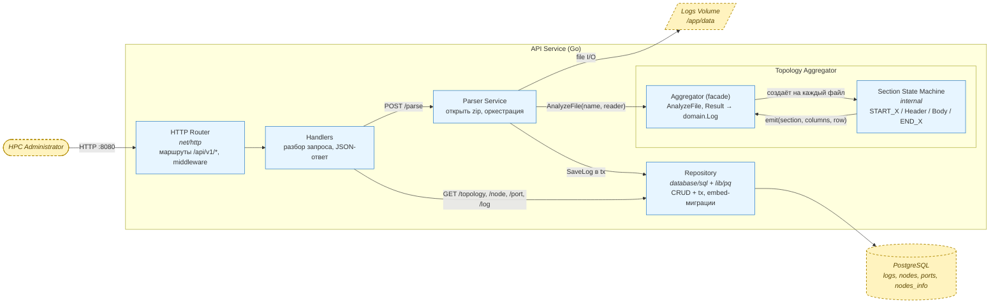

# Log Parser — Components (C3)

```mermaid
flowchart LR
    admin(["HPC Administrator"])
    db[("PostgreSQL<br/>logs, nodes, ports, nodes_info")]
    fs[/"Logs Volume<br/>/app/data"/]

    subgraph api["API Service (Go)"]
        direction TB
        router["HTTP Router<br/><i>net/http</i><br/>маршруты /api/v1/*, middleware"]
        handlers["Handlers<br/>разбор запроса, JSON-ответ"]
        parserSvc["Parser Service<br/>открыть zip, оркестрация"]

        subgraph agg["Topology Aggregator"]
            direction TB
            aggFacade["Aggregator (facade)<br/>AnalyzeFile, Result → domain.Log"]
            sm["Section State Machine<br/><i>internal</i><br/>START_X / Header / Body / END_X"]
        end

        repo["Repository<br/><i>database/sql + lib/pq</i><br/>CRUD + tx, embed-миграции"]
    end

    admin -- "HTTP :8080" --> router
    router --> handlers
    handlers -- "POST /parse" --> parserSvc
    handlers -- "GET /topology, /node, /port, /log" --> repo
    parserSvc -- "file I/O" --> fs
    parserSvc -- "AnalyzeFile(name, reader)" --> aggFacade
    aggFacade -- "создаёт на каждый файл" --> sm
    sm -- "emit(section, columns, row)" --> aggFacade
    parserSvc -- "SaveLog в tx" --> repo
    repo --> db

    classDef ext fill:#fff3bf,stroke:#b08900,stroke-width:1.5px,stroke-dasharray:5 4,color:#5a4500,font-style:italic
    classDef boundary fill:#f8faff,stroke:#3b5bdb,stroke-width:1.5px
    classDef internal fill:#e7f5ff,stroke:#1971c2
    class admin,db,fs ext
    class router,handlers,parserSvc,aggFacade,sm,repo internal
```
