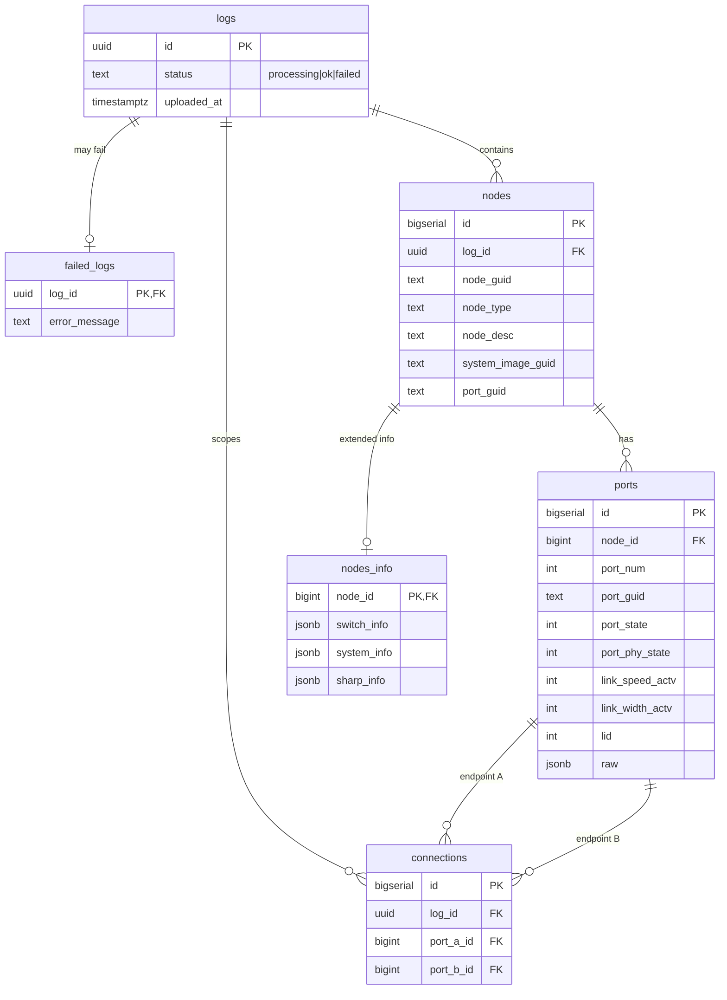

# Log Parser — Database ERD

```mermaid
erDiagram
    logs ||--o| failed_logs : "may fail"
    logs ||--o{ nodes : "contains"
    logs ||--o{ connections : "scopes"
    nodes ||--o{ ports : "has"
    nodes ||--o| nodes_info : "extended info"
    ports ||--o{ connections : "endpoint A"
    ports ||--o{ connections : "endpoint B"

    logs {
        uuid id PK
        text status "processing|ok|failed"
        timestamptz uploaded_at
    }

    failed_logs {
        uuid log_id PK,FK
        text error_message
    }

    nodes {
        bigserial id PK
        uuid log_id FK
        text node_guid
        text node_type
        text node_desc
        text system_image_guid
        text port_guid
    }

    ports {
        bigserial id PK
        bigint node_id FK
        int port_num
        text port_guid
        int port_state
        int port_phy_state
        int link_speed_actv
        int link_width_actv
        int lid
        jsonb raw
    }

    nodes_info {
        bigint node_id PK,FK
        jsonb switch_info
        jsonb system_info
        jsonb sharp_info
    }

    connections {
        bigserial id PK
        uuid log_id FK
        bigint port_a_id FK
        bigint port_b_id FK
    }
```
