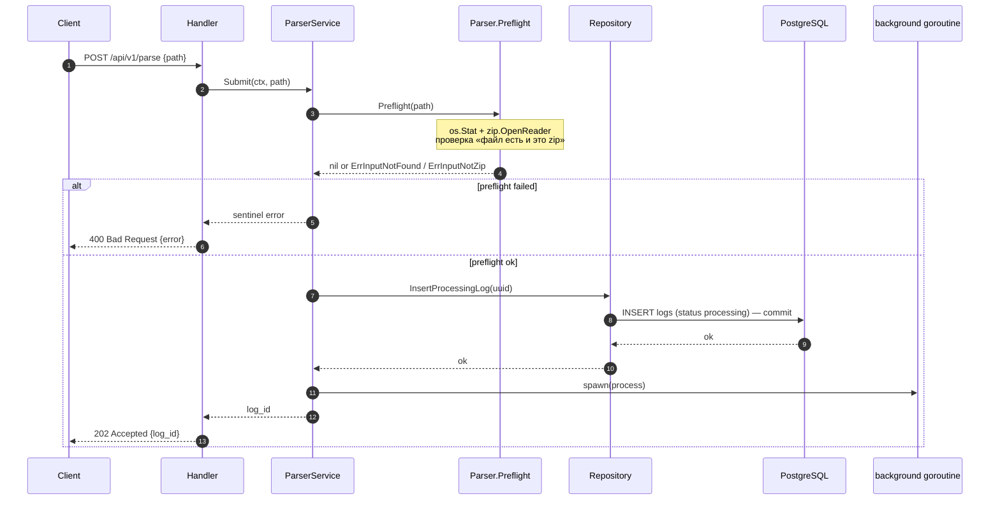
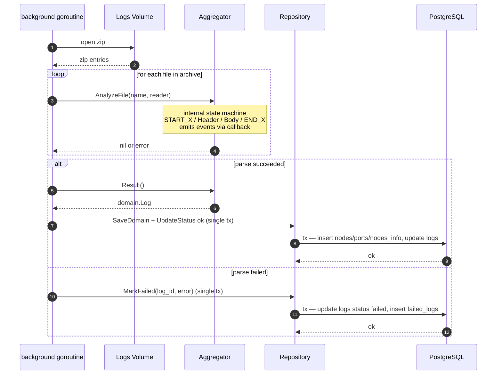
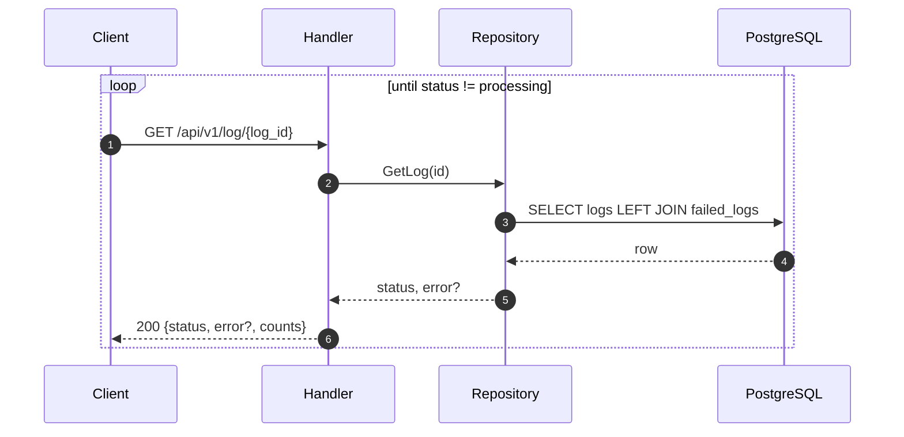
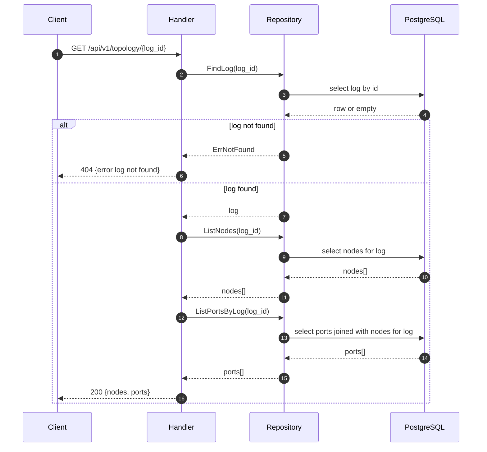
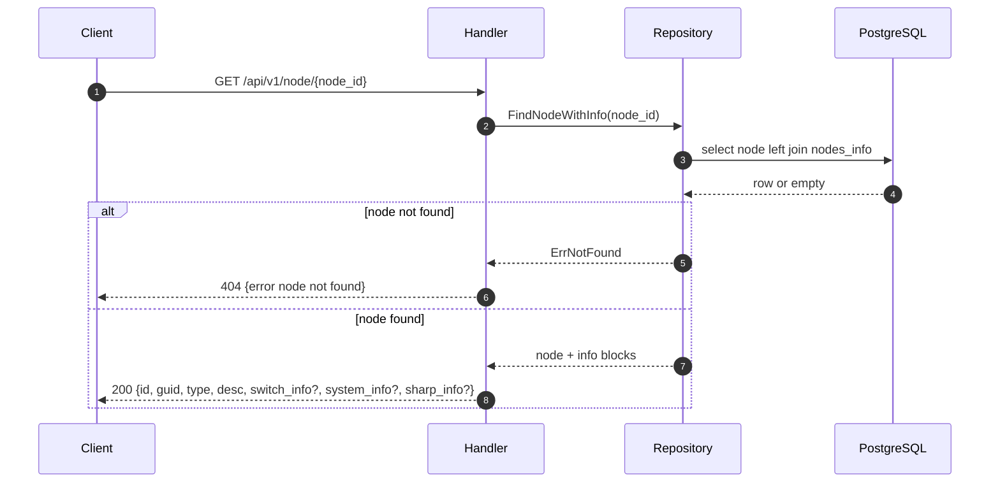
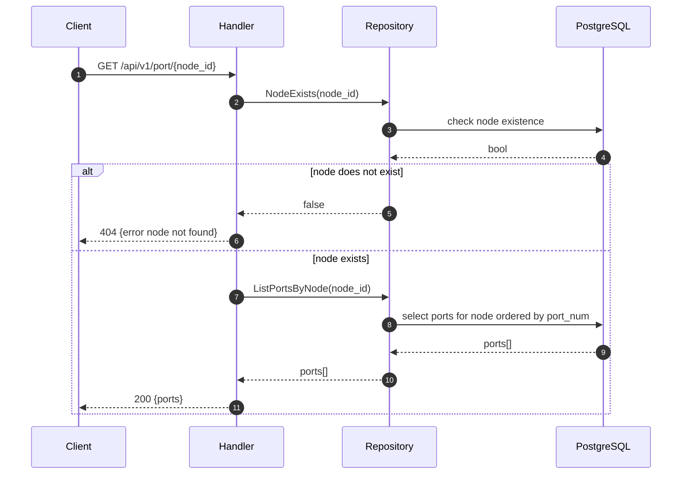
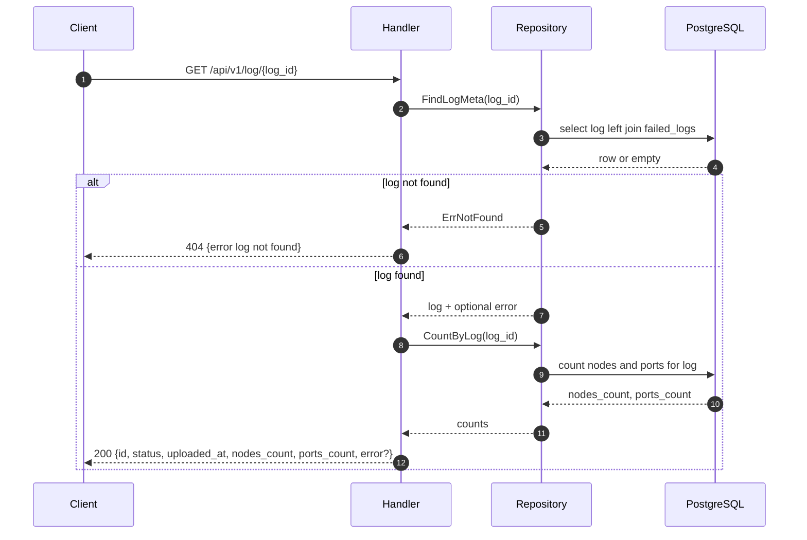
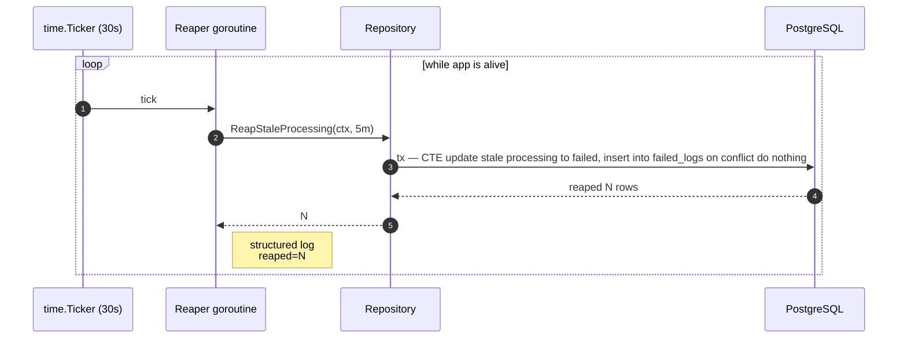

# Log Parser — Sequence Diagrams

## POST /api/v1/parse (async)

Парсинг асинхронный — клиент сразу получает `log_id`, обработка идёт в фоновой горутине. Статус узнавать через `GET /api/v1/log/{log_id}` (polling).

### Синхронная часть (HTTP-запрос)

### Фоновая горутина

### Клиентский polling

---

## GET /api/v1/topology/{log_id}

---

## GET /api/v1/node/{node_id}

---

## GET /api/v1/port/{node_id}

---

## GET /api/v1/log/{log_id}

---

## Reaper (background)

