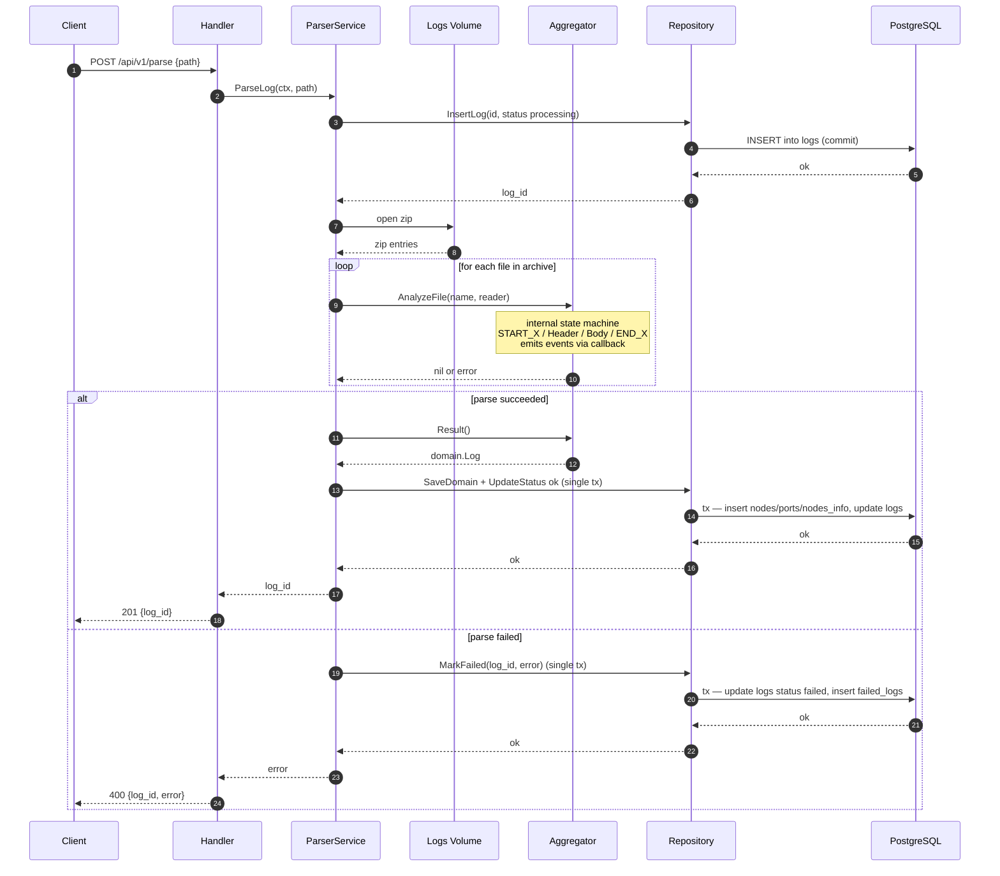
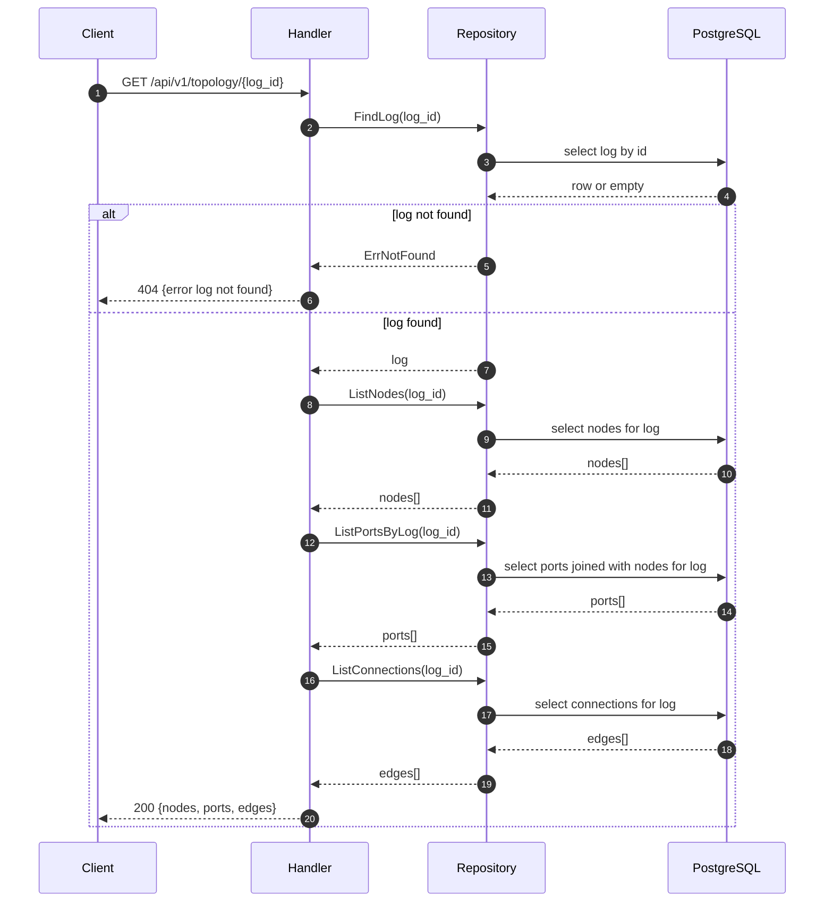
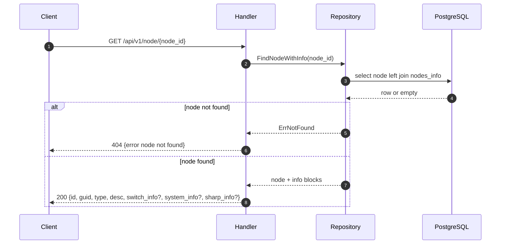
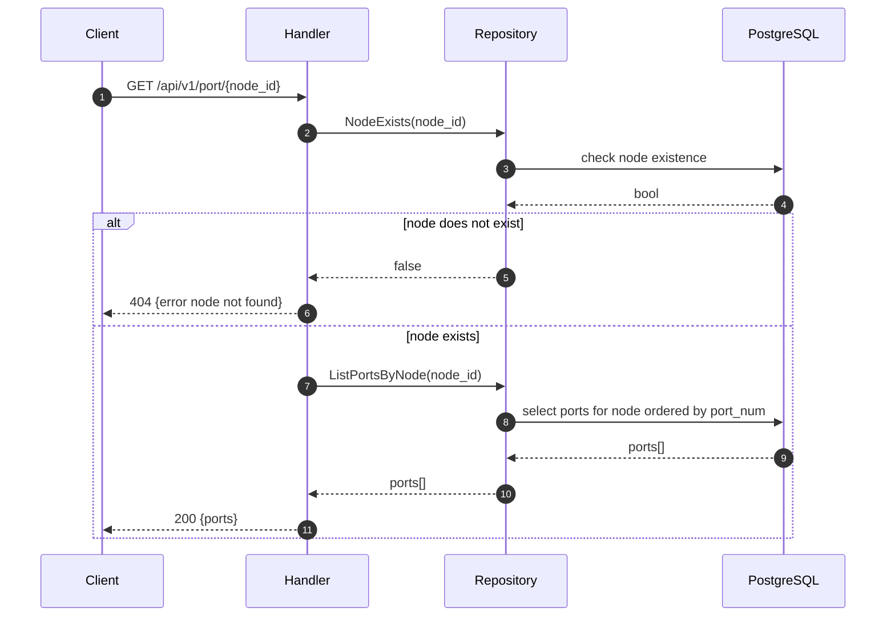
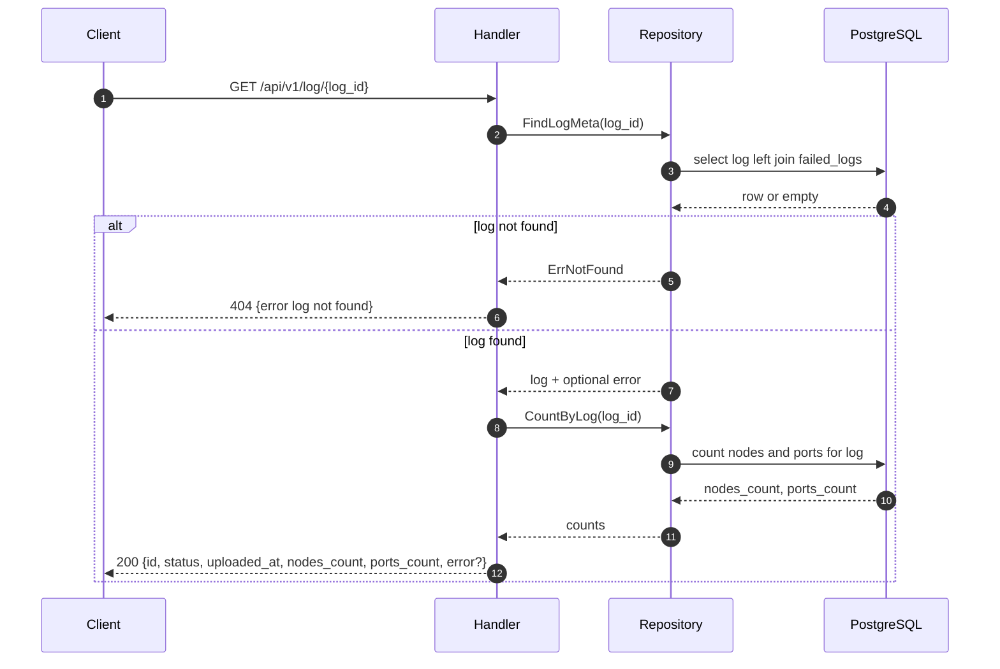
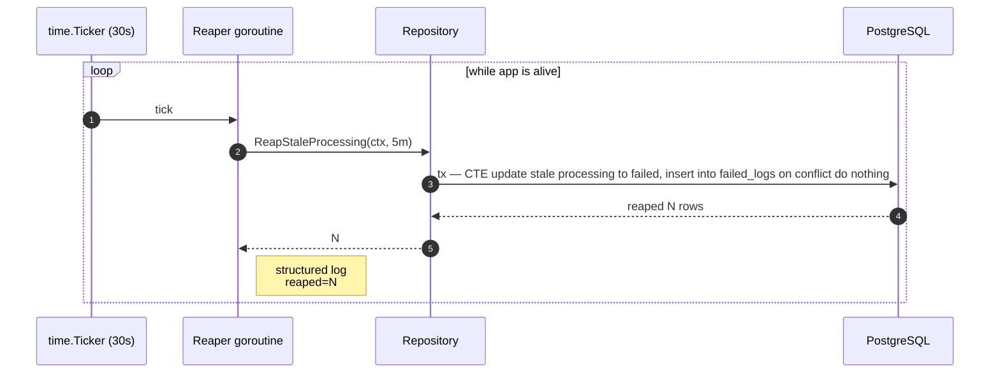

# Log Parser — Sequence Diagrams

## POST /api/v1/parse

---

## GET /api/v1/topology/{log_id}

---

## GET /api/v1/node/{node_id}

---

## GET /api/v1/port/{node_id}

---

## GET /api/v1/log/{log_id}

---

## Reaper (background)

